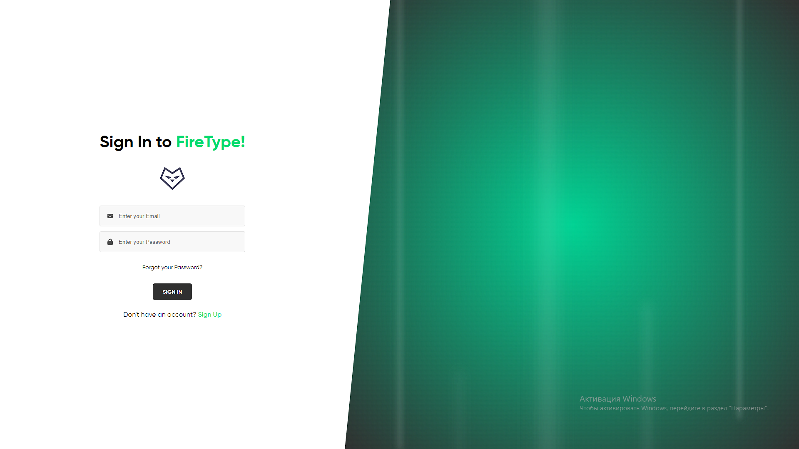
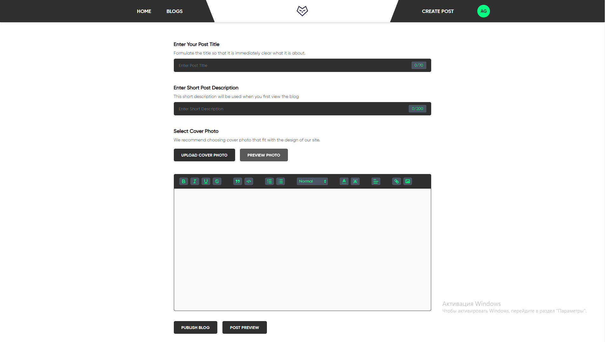
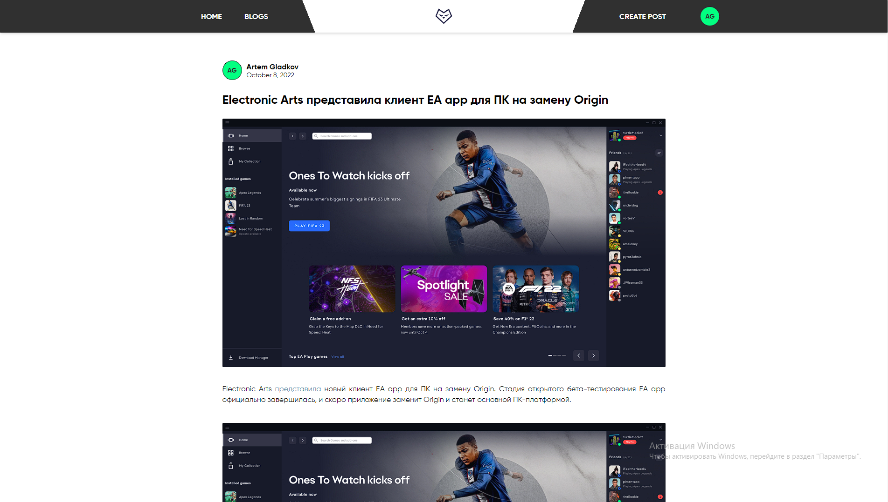

  

  
  &nbsp
  &nbsp
   
  &nbsp
  &nbsp
    
  &nbsp
  &nbsp
  
  &nbsp
  &nbsp
  

## Project objectives

<ul>
  <li>
    Learning how Firebase authorization works
  </li>

  <li>
    Using typescript with pinia state manager
  </li>

  <li>
    Explore the quill editor
  </li>

  <li>
    Hone my existing Vue skills and try something new =)
  </li>
</ul>

## Project preview

### Authorization

### Creating a post

### Post view

